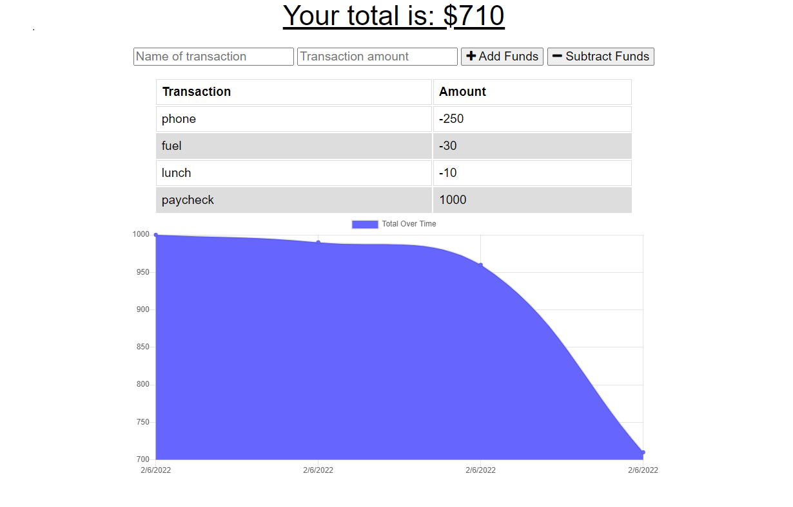

# budget-even-offline      
Boot camp challenge to enhance a budget app, so that if functions offline and as a PWA. Served by MongoDB and uploaded to Heroku.
  

## Table of Contents
* [Description](#description)
* [Installation](#installation)
* [Usage](#usage)
* [License](#license)
* [References](#reference)
* [Contributing](#contributing)
* [Tests](#tests)
* [Questions](#questions)

## Description 
_***Built With:***_ JavaScript,HTML,CSS,ES6,Node,MongoDB,Express,PWA, Heroku  
I enhanced this app to have offline functionality and to be more of a PWA. This was done using a service worker, indexedDB, and a manifest.json file. The app will register transactions made offline and then automatically upload them when connected to the internet again. A user is able to install this onto their desktop or their phone much like a phone App. I was given starter code of a basically functioning app. The excercise was to add the PWA like functionality. It went very well. Everything is working great. It was a great experience to be introduced to some newer technologies which are gaining in popularity. The database used is MongoDB and it is deployed live on Heroku.

## Installation 
Simply click the link, and check it out. It is deployed online. It isn't currently functional for individual users. If you would like to have your own copy, you will need to git clone the app onto your own system.

## Usage 
Very self explanitory. Go online to the app and check it out.

[Deployed Application](https://obscure-cliffs-76832.herokuapp.com/)

## License 
[MIT](./LICENSE)

## References 
None

## Contributing 
[Contributing Guidelines](./public/docs/contribute.txt)

## Tests 
N/A at this time

## Questions 
Contact: Sam Davenport  
https://github.com/steadysamwise4  
davenportsam44@gmail.com
    
